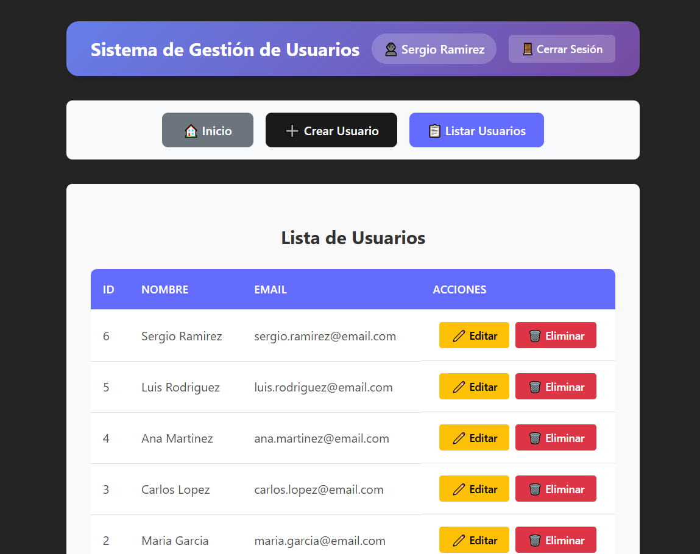

# 🚀 Sistema de Gestión de Usuarios

> **Proyecto Universitario** - Sistema web completo para la gestión de usuarios con autenticación y operaciones CRUD

**Hecho por:** Jesús Flórez



## 📋 Descripción

Sistema web moderno desarrollado con arquitectura cliente-servidor que permite la gestión completa de usuarios incluyendo:

- ✅ **Autenticación de usuarios** con sistema de login
- ✅ **Operaciones CRUD completas** (Crear, Leer, Actualizar, Eliminar)
- ✅ **Interfaz responsive** adaptable a dispositivos móviles
- ✅ **API RESTful** bien estructurada
- ✅ **Base de datos MySQL** para persistencia de datos

## 🛠️ Tecnologías Utilizadas

### Frontend
| Tecnología | Versión | Descripción |
|------------|---------|-------------|
| **React** | 18+ | Biblioteca para construir interfaces de usuario |
| **Vite** | 4+ | Herramienta de construcción rápida |
| **CSS3** | - | Estilos modernos con Flexbox y Grid |
| **Fetch API** | - | Para comunicación con el backend |

### Backend
| Tecnología | Versión | Descripción |
|------------|---------|-------------|
| **Node.js** | 18+ | Entorno de ejecución de JavaScript |
| **Express.js** | 4+ | Framework web para Node.js |
| **MySQL** | 8+ | Sistema de gestión de base de datos |
| **CORS** | - | Middleware para manejo de CORS |

## 📊 Endpoints de la API

### 🔐 Autenticación

| Método | Endpoint | Descripción | Body |
|--------|----------|-------------|------|
| `POST` | `/api/usuarios/login` | Iniciar sesión | `{ "email": "string", "password": "string" }` |

**Respuesta exitosa:**
```json
{
  "message": "Login exitoso",
  "user": {
    "id": 1,
    "nombre": "Nombre Usuario",
    "email": "usuario@example.com"
  }
}
```

### 👤 Gestión de Usuarios

| Método | Endpoint | Descripción | Parámetros | Body |
|--------|----------|-------------|------------|------|
| `GET` | `/api/usuarios` | Obtener todos los usuarios | - | - |
| `GET` | `/api/usuarios/:id` | Obtener usuario por ID | `id` (número) | - |
| `POST` | `/api/usuarios` | Crear nuevo usuario | - | `{ "nombre": "string", "email": "string" }` |
| `PUT` | `/api/usuarios/:id` | Actualizar usuario | `id` (número) | `{ "nombre": "string", "email": "string" }` |
| `DELETE` | `/api/usuarios/:id` | Eliminar usuario | `id` (número) | - |

### 📝 Ejemplos de Respuestas

**GET /api/usuarios** - Obtener todos los usuarios:
```json
[
  {
    "id": 1,
    "nombre": "Juan Pérez",
    "email": "juan@example.com"
  },
  {
    "id": 2,
    "nombre": "María García",
    "email": "maria@example.com"
  }
]
```

**POST /api/usuarios** - Crear usuario:
```json
{
  "message": "Usuario creado exitosamente",
  "id": 3,
  "nombre": "Nuevo Usuario",
  "email": "nuevo@example.com"
}
```

## 🚀 Instalación y Configuración

### Prerrequisitos
- Node.js (versión 18 o superior)
- MySQL (versión 8 o superior)
- npm o yarn

### 1. Clonar el repositorio
```bash
git clone <url-del-repositorio>
cd proyecto-usuarios
```

### 2. Configurar la Base de Datos
1. Crear una base de datos MySQL llamada `usuarios_db`
2. Crear la tabla `usuarios`:
```sql
CREATE TABLE usuarios (
  id INT AUTO_INCREMENT PRIMARY KEY,
  nombre VARCHAR(100) NOT NULL,
  email VARCHAR(100) NOT NULL UNIQUE
);
```

### 3. Backend
```bash
cd backend
npm install
npm start
```
El servidor se ejecutará en: `http://localhost:5001`

### 4. Frontend
```bash
cd frontend
npm install
npm run dev
```
La aplicación se ejecutará en: `http://localhost:5173`

## 🔧 Configuración de Variables de Entorno

Modificar el archivo `database.js` en la carpeta `backend/config`:
```env
host: 'localhost',
user: 'root',
password: 'root',
database: 'usuarios_app'
```

## 🎯 Características Principales

### Autenticación
- **Login seguro** con validación de credenciales
- **Persistencia de sesión** usando localStorage
- **Contraseña universal** para demo: `123456`

### Interfaz de Usuario
- **Diseño responsive** que se adapta a móviles y desktop
- **Navegación intuitiva** con botones de acción claros
- **Feedback visual** para todas las operaciones
- **Manejo de errores** con mensajes informativos

### Funcionalidades CRUD
- **Crear usuarios** con validación de formularios
- **Listar usuarios** en tabla organizada
- **Editar usuarios** con formulario pre-rellenado
- **Eliminar usuarios** con confirmación de seguridad

## 🧪 Uso del Sistema

### 1. Acceso al Sistema
1. Abrir `http://localhost:5173`
2. Usar credenciales de cualquier usuario registrado
3. Contraseña: `123456` (para todos los usuarios)

### 2. Gestión de Usuarios
- **Crear**: Clic en "Crear Usuario" → Llenar formulario → Guardar
- **Listar**: Clic en "Listar Usuarios" → Ver tabla completa
- **Editar**: En la lista, clic en "Editar" → Modificar datos → Actualizar
- **Eliminar**: En la lista, clic en "Eliminar" → Confirmar acción

## 📁 Estructura del Proyecto

```
proyecto-usuarios/
├── backend/
│   ├── config/
│   │   └── database.js
│   ├── routes/
│   │   └── usuarios.js
│   ├── package.json
│   └── server.js
├── frontend/
│   ├── public/
│   ├── src/
│   │   ├── components/
│   │   │   ├── CreateUser.jsx
│   │   │   ├── EditUser.jsx
│   │   │   ├── Login.jsx
│   │   │   └── userList.jsx
│   │   ├── App.css
│   │   ├── App.jsx
│   │   └── main.jsx
│   ├── package.json
│   └── vite.config.js
├── imgs/
│   └── example.png
└── README.md
```

## 📄 Licencia

Este proyecto es de uso académico y educativo.